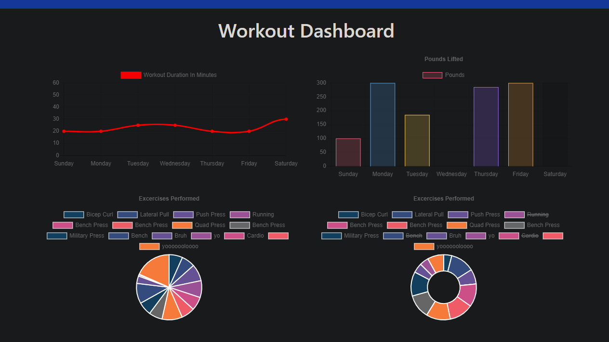

# Fitness Tracker

## Table of Contents

[Description](#description)

[Contributing](#contributing)

[Questions](#questions)

## Description

Do you even lift, bro??!??#@??

Just a simple app to track workouts. The user can create a new workout comprised of whatever exercises they like. The last workout can be accessed and updated.

The application was deployed using Heroku: [URL](https://boiling-hamlet-55992.herokuapp.com/)

## Contributing

Not accepting pull requests at this time.

## Questions

###### For questions, please contact me at tldavis09@yahoo.com

